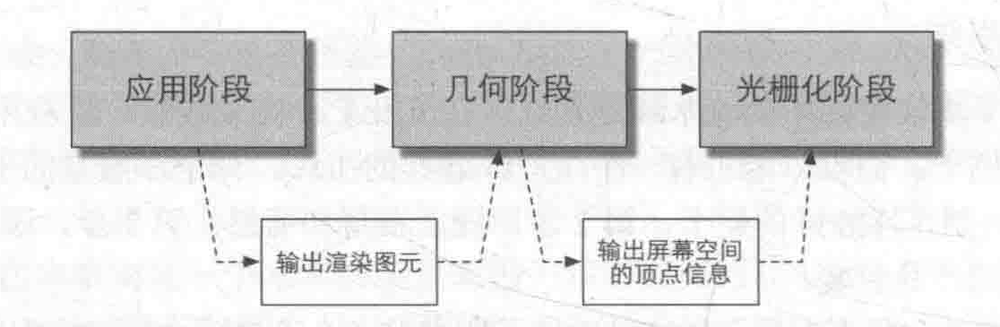
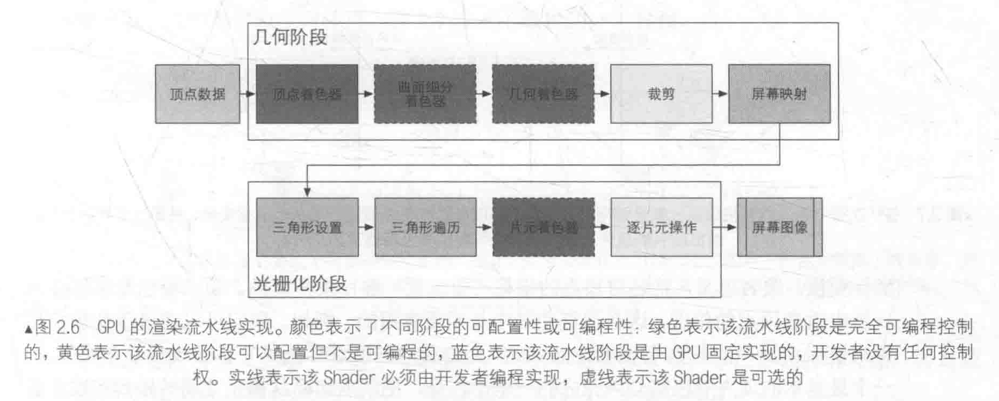
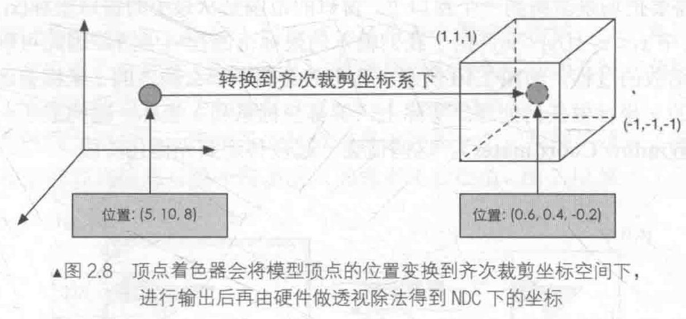
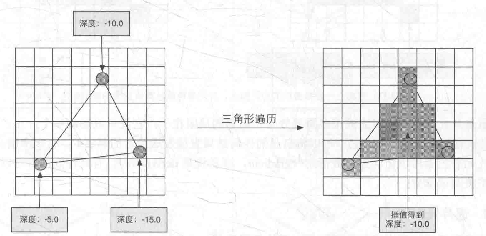
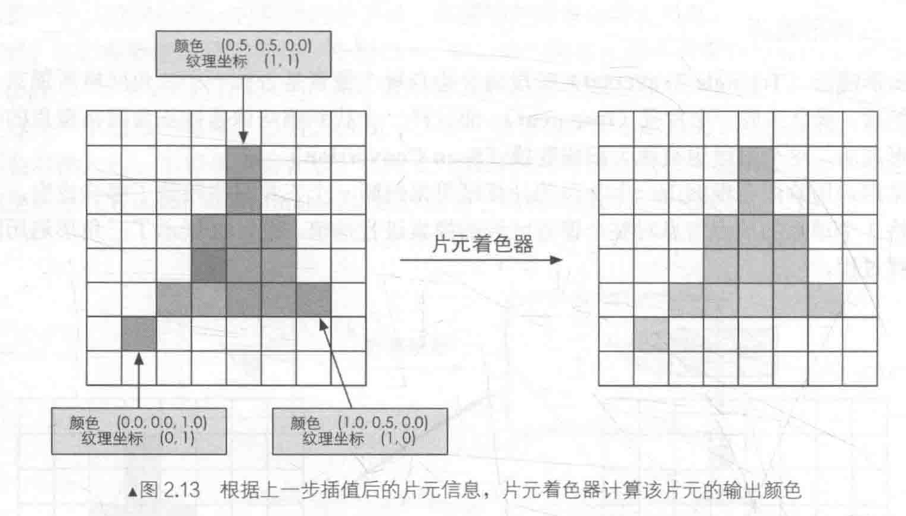
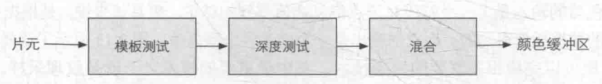
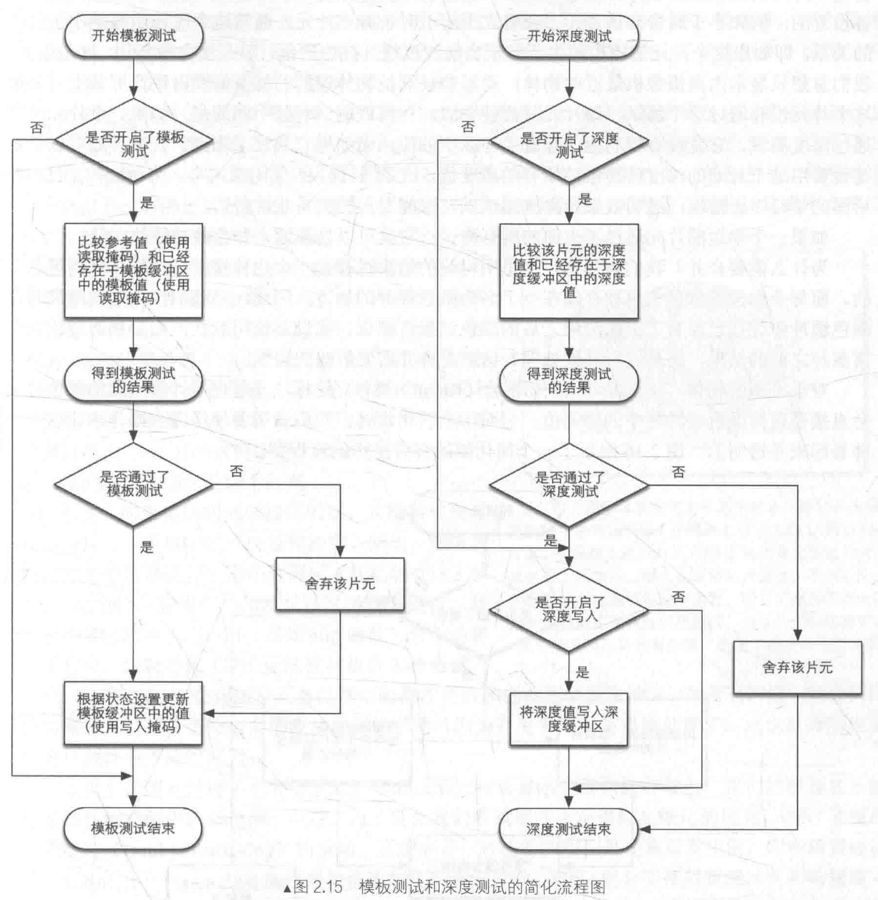

# 渲染流水线
---
## 三个阶段：
* 应用阶段
* 几何阶段
* 光栅化阶段

</img>

---
## 应用阶段(Application Stage)：
* 把所有渲染所需的网格和纹理等数据从硬盘中加载到内存中，再加载到显存中
* 设置渲染状态
* 调用Draw Call($CPU \rightarrow GPU$)
---
## GPU流水线：

</img>

### 几何阶段(Geometry Stage):
  * **顶点着色器(Vertex Shader)**:完全可编程，实现顶点的空间变换、顶点着色等功能
  * **曲面细分着色器(Tessellation Shader)**:可选，用于细分面元
  * **几何着色器(GeometryShader)**:可选，用于执行逐面元的着色操作或产生更多面元
  * **裁剪(Clipping)**:可配置，将不在摄像机视野内的顶点裁剪掉，并剔除某些三角面元的面片
  * **屏幕映射(Screen Mapping)**:不可配置和编程，把图元坐标转换到屏幕坐标
### 光栅化阶段(Rasterizer Stage):
* **三角形设置(Triangle Setup)**:固定
* **三角形遍历(Triangle Traversal)**:固定
* **片元着色器(Fragment Shader)**:完全可编程，实现逐片元的着色操作
* **逐片元操作(Per-Fragment Operations)**:可配置，执行修改颜色、深度缓冲、混合等操作
---
### 顶点着色器(Vertex Shader):
* 输入的每个顶点都会调用一次顶点着色器，不可创建或销毁顶点，无法得到顶点间的关系（如是否属于同一个三角网络）。主要工作：进行坐标变换和逐顶点光照，还可以计算和输出顶点的颜色。
* 坐标变换:把顶点坐标从模型空间转换到其次裁剪空间，可以在这一步中改变顶点的位置，最终得到归一化的设备坐标(Normalized Device Coordinates,NDC)

</img>

### 裁剪(Clipping):
* 图元和摄像机视野关系：完全在视野内、部分在视野内、完全在视野外
* 完全在视野内向下传递，完全在视野外不继续向下传递，部分在视野内裁剪到单位立方体中
### 屏幕映射(Screen Mapping):
* 把每个图元的x和y坐标转换到屏幕坐标系，z坐标不处理，屏幕坐标系和z坐标构成的窗口坐标系向下传递
### 三角形设置(Triangle Setup):
* **光栅化(Rasterization)**:把顶点数据转换为片元的过程
* 计算光栅化一个三角网络所需的信息，根据上一个阶段输出的三角网络的顶点，计算每条边上的像素坐标，得到三角形边界的表示方式
### 三角形遍历(Triangle Traversal):
* 检查每个像素是否被一个三角网络所覆盖，如果被覆盖的话生成一个片元，使用三个顶点的顶点信息对整个覆盖区域的元素进行插值
* 输出一个片元序列

</img>

### 片元着色器(Fragment Shader):
* 对单个片元进行操作，输出一个或多个颜色值，可完成许多重要的渲染技术如纹理采样
* **纹理采样**:在顶点着色器阶段输出每个顶点对应的纹理坐标，经过光栅化阶段对三角网络的三个顶点对应的纹理坐标进行插值，得到其覆盖的片元的纹理坐标

</img>

### 逐片元操作(Per-Fragment Operations):
#### 主要任务：
* 决定每个片元的可见性，进行测试工作如深度测试、模板测试
* 对通过测试的片元，把片元的颜色值和已经存储在颜色缓冲区中的颜色进行合并

</img>

#### 测试：

</img>

#### 合并
* 对不透明物体，可以关闭混合(Blend)操作，片元着色器计算得到的颜色值会覆盖颜色缓冲区中的像素值
* 对半透明物体，需开启混合操作，对源颜色和目标颜色使用混合函数进行混合，可以选择混合模式

</img>

* 将图元显示到屏幕上，使用双重缓冲(Double Buffering)
---